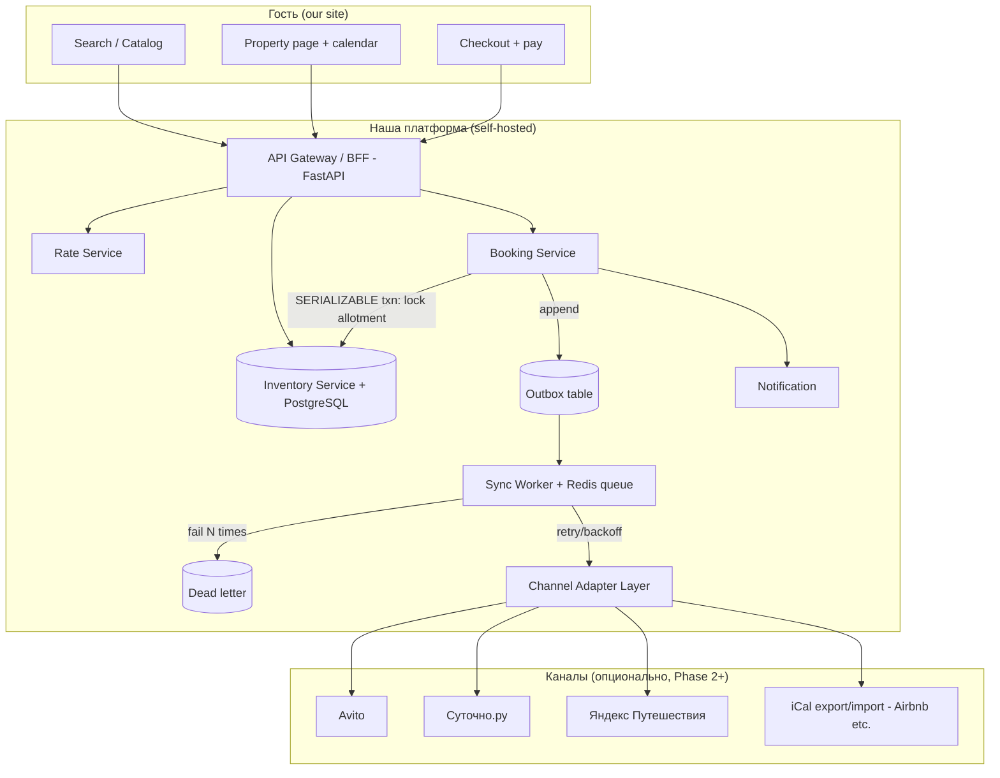
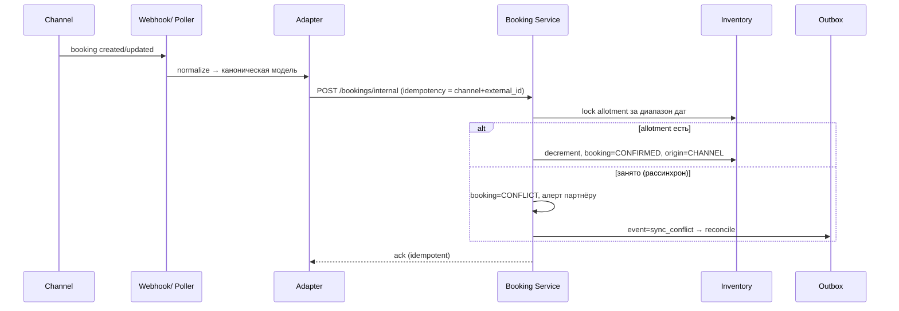

# B2B2C Marketplace — Architecture Blueprint
**Версия:** 0.1 · **Статус:** draft for founder review · **Дата:** 2026-09-24

---

## 1. Executive summary (≤20 строк)

- **Что строим:** собственную B2B2C-платформу бронирования размещения (отели, номера, апарты, комнаты). Партнёр заводит объекты в нашем кабинете на нашем домене, гость бронирует и платит у нас, мы берём комиссию с подтверждённой брони.
- **Что НЕ строим:** не делаем «обёртку над RealtyCalendar/Bnovo/Travelline», не перепродаём чужой channel manager как ядро, не скрейпим площадки, не обходим ToS.
- **Source of truth:** наша PostgreSQL. Любая внешняя площадка (Avito, Суточно.ру, Яндекс Путешествия, Airbnb) — это *канал*, подключаемый адаптером: читаем из неё данные и/или пушим в неё изменения, но «главный календарь» всегда у нас.
- **Double booking** убирается не «синхронизацией», а тем, что **все продажи идут в одну точку**: наш booking service транзакционно уменьшает allotment в нашей БД (pessimistic lock + hold TTL + idempotency). Каналы — вторичны и отстают по latency; поэтому для каналов, где нет real-time API, держим буфер/overbooking-политику и reconciliation cron.
- **MVP (Phase 1, 4–8 нед):** полный цикл на нашем сайте — каталог, поиск, карточка, календарь, hold → подтверждение, кабинет партнёра (шахматка, цены, закрытие дат), админка (комиссии, партнёры, отчёты). **Без единого OTA.**
- **Phase 2 (+4–6 нед):** первый адаптер (самый реалистичный для РФ — iCal export/import как универсальный минимум + один write-API канал при наличии партнёрского доступа), import busy dates read-only, export block dates.
- **Phase 3 (+6–10 нед):** двусторонний API-канал, webhooks от каналов, синхронизация тарифов/restrictions, рейты по каналам.
- **Монетизация:** % с подтверждённой брони (commission rule на уровне объекта/партнёра), позже — листинг-fee и premium-размещение.
- **Стек:** Python 3.12 + FastAPI + asyncpg/psycopg3 + PostgreSQL + Redis + ручные SQL-миграции. Фронт: React + TS + Vite + Tailwind 4. Всё self-hosted (Docker Compose → VPS).
- **Оценка трудозатрат:** Phase 1 — 6–10 человеко-недель для команды 1.5–2 человека (середина- senior backend + frontend). Порядок величин, не точная смета.

---

## 2. Архитектура (self-hosted)

### 2.1 Сервисы (логические, можно разворачивать в одном процессе на старте — модулями)

| Сервис | Обязанность | Границы |
|---|---|---|
| **Partner API** | CRUD property, room types/unit types, фото, политики, тарифы. Авторизация партнёра (JWT). | Не знает про каналы |
| **Inventory Service** | Allotment по `(unit_type_id, date)`: свободно/занято/hold. Атомарное резервирование. | Единственное место, где «правда» о доступности |
| **Rate Service** | Rate plans, seasonal prices, restrictions (min stay, CTA/CTD, stop sell). | Питает каталог и export в каналы |
| **Booking Service** | State machine: hold → paid → confirmed → cancelled/failed. Idempotency. | Не пишет в каналы напрямую — через Outbox |
| **Channel Adapter Layer** | Plugin per channel: `IChannelAdapter` (pushRates, pushAvailability, pullBookings, pushBooking). Под фиче-флагами | Транслирует нашу модель в модель канала |
| **Sync Worker** | Читает OutboxEvent, ретраи (exp backoff), dead-letter queue, SyncLog | Гарантия at-least-once + idempotency на стороне канала |
| **Notification** | email (self-hosted Postfix или Postmark — **один провайдер**, не абстракция из 5), Telegram-бот партнёру | Не бизнес-логика |
| **Payment** | **ЗАГЛУШКА** в Phase 1: `PAYMENT_MODE=stub` — имитация успешной оплаты, мгновенный `confirmed`. Интерфейс `PaymentProvider`; реальный эквайринг — реализация позже | Не блокирует ядро; подключается через интерфейс |
| **Admin API** | Комиссии, партнёры, репорты, модерация объектов | Отдельный scope авторизации |

### 2.2 Mermaid: общий поток



### 2.3 Mermaid: партнёр правит календарь у нас

```mermaid
sequenceDiagram
    participant P as Partner cabinet
    participant API as Partner API
    participant DB as PostgreSQL
    participant OUT as Outbox
    participant W as Sync Worker
    participant C as Channel(s)

    P->>API: PATCH /inventory {unit_type, from, to, closed=true}
    API->>DB: BEGIN; SELECT ... FOR UPDATE на диапазон
    API->>DB: UPDATE inventory_day SET closed
    API->>OUT: INSERT outbox_event (type=availability_changed)
    API->>DB: COMMIT
    API-->>P: 200 OK (fast — без ожидания каналов)
    W->>OUT: claim event
    W->>C: push availability (API или iCal refresh)
    alt ошибка
        W->>W: retry × N, потом DLQ
    end
```

> Ключевой момент: ответ партнёру не ждёт канал. Канал — eventual consistency.

### 2.4 Mermaid: inbound-бронь из канала (Phase 3, но схема важна сейчас)



### 2.5 Mermaid: conflict resolution (reconciliation cron)

```mermaid
flowchart LR
    CRON[Reconciliation cron, каждые 15 мин] --> CMP[Сравнить local occupancy vs snapshot канала]
    CMP -->|совпадает| OK[OK]
    CMP -->|канал продал, у нас свободно| M1[Импортировать бронь как origin=CHANNEL, уменьшить allotment]
    CMP -->|у нас продано, канал открыт| M2[Закрыть даты в канале (push), поставить hold-буфер]
    CMP -->|both sold, разные гости| M3[CONFLICT: ручное разрешение в админке, compensate]
```

---

## 3. Модель данных (SQL)

> Конвенция: `snake_case`, uuid PK (`gen_random_uuid()`), `created_at/updated_at`, soft-delete только где важно (property). Время хранится в **UTC**; `property.timezone` (IANA, напр. `Asia/Yekaterinburg`) определяет «ночь».

### 3.1 Ключевые таблицы

```sql
-- Партнёр (юрик/самозанятый/физлицо)
CREATE TABLE partner (
  id              uuid PRIMARY KEY DEFAULT gen_random_uuid(),
  email           citext UNIQUE NOT NULL,
  phone           text,
  status          text NOT NULL DEFAULT 'pending' CHECK (status IN ('pending','active','blocked')),
  legal_type      text NOT NULL CHECK (legal_type IN ('individual','self_employed','llc')),
  created_at      timestamptz NOT NULL DEFAULT now()
);

-- Объект размещения
CREATE TABLE property (
  id              uuid PRIMARY KEY DEFAULT gen_random_uuid(),
  partner_id      uuid NOT NULL REFERENCES partner(id),
  name            text NOT NULL,
  property_type   text NOT NULL CHECK (property_type IN ('hotel','apartment','house','room','hostel')),
  timezone        text NOT NULL,            -- IANA
  checkin_time    time NOT NULL DEFAULT '14:00',
  checkout_time   time NOT NULL DEFAULT '12:00',
  currency        text NOT NULL DEFAULT 'RUB',
  status          text NOT NULL DEFAULT 'draft' CHECK (status IN ('draft','pending_moderation','published','blocked')),
  lat, lng        double precision,
  address         jsonb NOT NULL DEFAULT '{}',
  created_at      timestamptz NOT NULL DEFAULT now()
);

-- Тип номера / unit type (для квартир = 1 unit type)
CREATE TABLE unit_type (
  id              uuid PRIMARY KEY DEFAULT gen_random_uuid(),
  property_id     uuid NOT NULL REFERENCES property(id),
  name            text NOT NULL,              -- "Стандарт twin"
  capacity        int  NOT NULL CHECK (capacity>0),
  total_units     int  NOT NULL DEFAULT 1 CHECK (total_units>0),  -- сколько физических номеров этого типа
  overbooking     int  NOT NULL DEFAULT 0 CHECK (overbooking>=0), -- ЖЁСТКО 0 по умолчанию
  created_at      timestamptz NOT NULL DEFAULT now()
);

-- Allotment по дням. Строки генерируются на N лет вперёд (job).
CREATE TABLE inventory_day (
  unit_type_id    uuid NOT NULL REFERENCES unit_type(id),
  date            date NOT NULL,
  available       int  NOT NULL DEFAULT 0 CHECK (available>=0),
  hold            int  NOT NULL DEFAULT 0 DEFAULT 0,   -- брони в hold (не оплачены)
  sold            int  NOT NULL DEFAULT 0 DEFAULT 0,   -- подтверждённые
  closed          boolean NOT NULL DEFAULT false,      -- stop sell вручную
  PRIMARY KEY (unit_type_id, date)
);
-- Уникальный PK (unit_type_id,date) — он же target для SELECT ... FOR UPDATE.

CREATE TABLE rate_plan (
  id              uuid PRIMARY KEY DEFAULT gen_random_uuid(),
  unit_type_id    uuid NOT NULL REFERENCES unit_type(id),
  name            text NOT NULL,             -- "Невозвратный", "Гибкий"
  cancellation_policy text NOT NULL,
  active          boolean NOT NULL DEFAULT true
);

CREATE TABLE price_day (
  rate_plan_id    uuid NOT NULL REFERENCES rate_plan(id),
  date            date NOT NULL,
  price           numeric(12,2) NOT NULL CHECK (price>=0),
  min_stay        int  NOT NULL DEFAULT 1,
  max_stay        int,
  cta             boolean NOT NULL DEFAULT true,   -- check-in allowed
  ctd             boolean NOT NULL DEFAULT true,   -- check-out allowed
  stop_sell       boolean NOT NULL DEFAULT false,
  PRIMARY KEY (rate_plan_id, date)
);

CREATE TABLE booking (
  id              uuid PRIMARY KEY DEFAULT gen_random_uuid(),
  code            text UNIQUE NOT NULL,            -- "BK-7K2Q9F" для гостя
  idempotency_key text UNIQUE,                      -- client-supplied, предотвращает дубль при ретрае
  property_id     uuid NOT NULL REFERENCES property(id),
  unit_type_id    uuid NOT NULL REFERENCES unit_type(id),
  guest_name      text NOT NULL,
  guest_email     citext NOT NULL,
  guest_phone     text NOT NULL,
  checkin_date    date NOT NULL,
  checkout_date   date NOT NULL,
  checkin_ts      timestamptz GENERATED ALWAYS AS (checkin_date + checkin_time) STORED, -- см. note
  status          text NOT NULL CHECK (status IN ('hold','paid','confirmed','cancelled','failed','conflict','no_show','refunded')),
  origin          text NOT NULL DEFAULT 'web' CHECK (origin IN ('web','channel')),
  source_channel  text,                            -- 'avito','sutochno','ical', null для web
  external_ref    text,                            -- id брони на канале
  total_amount    numeric(12,2) NOT NULL,
  commission_rate numeric(5,4) NOT NULL,
  commission_amt  numeric(12,2) NOT NULL,
  hold_expires_at timestamptz,                     -- TTL инвентаря (15 мин на оплату)
  paid_at         timestamptz,
  cancelled_at    timestamptz,
  cancel_deadline timestamptz,                     -- бесплатная отмена до этого момента (24:00 пред.дня)
  created_at      timestamptz NOT NULL DEFAULT now(),
  CHECK (checkout_date > checkin_date)
);

CREATE TABLE booking_line (
  id              uuid PRIMARY KEY DEFAULT gen_random_uuid(),
  booking_id      uuid NOT NULL REFERENCES booking(id),
  date            date NOT NULL,
  price           numeric(12,2) NOT NULL,
  UNIQUE (booking_id, date)
);

CREATE TABLE payment (
  id              uuid PRIMARY KEY DEFAULT gen_random_uuid(),
  booking_id      uuid NOT NULL REFERENCES booking(id),
  provider        text NOT NULL DEFAULT 'stub' CHECK (provider IN ('stub','tinkoff','yookassa')),
  external_id     text,
  amount          numeric(12,2) NOT NULL,
  status          text NOT NULL CHECK (status IN ('pending','succeeded','failed','refunded')),
  created_at      timestamptz NOT NULL DEFAULT now()
);

CREATE TABLE commission_rule (
  id              uuid PRIMARY KEY DEFAULT gen_random_uuid(),
  partner_id      uuid REFERENCES partner(id),    -- null = глобальное правило
  property_id     uuid REFERENCES property(id),
  rate            numeric(5,4) NOT NULL CHECK (rate BETWEEN 0 AND 1),
  valid_from      date,
  valid_to        date,
  priority        int NOT NULL DEFAULT 0
);

-- Связь объекта/типа номера с каналом
CREATE TABLE channel_link (
  id              uuid PRIMARY KEY DEFAULT gen_random_uuid(),
  unit_type_id    uuid NOT NULL REFERENCES unit_type(id),
  channel         text NOT NULL,             -- 'avito','sutochno','yandex','ical'
  credentials     jsonb NOT NULL,            -- encrypted (api_key / ical_url)
  direction       text NOT NULL CHECK (direction IN ('read','write','both')),
  enabled         boolean NOT NULL DEFAULT false,
  last_sync_at    timestamptz
);

CREATE TABLE external_mapping (
  id              uuid PRIMARY KEY DEFAULT gen_random_uuid(),
  channel_link_id uuid NOT NULL REFERENCES channel_link(id),
  entity_type     text NOT NULL,              -- 'unit_type','rate_plan'
  internal_id     uuid NOT NULL,
  external_id     text NOT NULL,
  UNIQUE (channel_link_id, entity_type, external_id)
);

-- Outbox: всё, что надо отправить наружу
CREATE TABLE outbox_event (
  id              uuid PRIMARY KEY DEFAULT gen_random_uuid(),
  aggregate       text NOT NULL,             -- 'booking','inventory','rate'
  aggregate_id     uuid NOT NULL,
  type            text NOT NULL,             -- 'booking.confirmed','availability.changed','rate.changed'
  payload         jsonb NOT NULL,
  channel_filter  text,                      -- null = все каналы объекта
  status          text NOT NULL DEFAULT 'pending' CHECK (status IN ('pending','in_flight','done','dead')),
  attempts        int NOT NULL DEFAULT 0,
  next_retry_at   timestamptz NOT NULL DEFAULT now(),
  created_at      timestamptz NOT NULL DEFAULT now()
);

CREATE TABLE sync_log (
  id              uuid PRIMARY KEY DEFAULT gen_random_uuid(),
  channel_link_id uuid REFERENCES channel_link(id),
  direction       text NOT NULL,
  event_type      text NOT NULL,
  external_ref    text,
  status          text NOT NULL,             -- 'ok','error','conflict'
  error           text,
  created_at      timestamptz NOT NULL DEFAULT now()
);
```

### 3.2 Индексы

```sql
CREATE INDEX idx_inv_date        ON inventory_day (date);
CREATE INDEX idx_price_day_date  ON price_day (date);
CREATE INDEX idx_booking_prop_dates ON booking (property_id, checkin_date, checkout_date) WHERE status IN ('paid','confirmed');
CREATE INDEX idx_outbox_pending  ON outbox_event (status, next_retry_at) WHERE status IN ('pending','in_flight');
CREATE INDEX idx_synclog_link    ON sync_log (channel_link_id, created_at DESC);
```

### 3.3 Правила

- **Ночь** = дата в `checkin_date..checkout_date` интервал `[checkin, checkout)`. Бронь на 3 ночи = 3 строки `booking_line` и декремент по 3 `inventory_day`.
- **`available = total_units − hold − sold − closed?`** — closed не вычитается из available, а считается фильтром (stop sell имеет приоритет).
- **Overbooking = 0** по умолчанию; инвариант `hold + sold ≤ total_units` проверяется в транзакции.
- **Timezone:** все расчёты «день» идут по `property.timezone`; хранение дат — `date` (не timestamptz), чтобы не было «сдвига ночи».

---

## 4. Anti-double-booking (алгоритм)

### 4.1 Почему синхронизация не спасает

Любая синхронизация между двумя системами имеет latency > 0. Две брони в две разные системы за один и тот же слот возможны всегда. Значит, **главное окно продаж должно быть одно** — наша БД, а каналы получают данные с задержкой и могут получать отказ.

### 4.2 Ядро: транзакционное резервирование

```text
POST /bookings/hold (idempotency-key: <uuid> от клиента)
1. BEGIN ISOLATION SERIALIZABLE  (или REPEATABLE READ + явный lock)
2. SELECT available, hold, sold, closed
   FROM inventory_day
   WHERE unit_type_id = :ut AND date BETWEEN :ci AND (:co - 1)
   ORDER BY (unit_type_id, date)
   FOR UPDATE;                       -- блокируем диапазон по возрастанию ключа
3. Проверки:
     - все строки существуют и не closed
     - available - hold >= ночей (для каждой ночи available>0)
     - min_stay / CTA-CTD из price_day
4. UPDATE inventory_day SET hold = hold + 1 ... (на каждую ночь)
5. INSERT booking (status='hold', hold_expires_at = now()+15min)
6. INSERT outbox_event('booking.held')   -- для отмены TTL и нотификации
7. COMMIT
```

**Сортировка `ORDER BY` при `FOR UPDATE`** устраняет дедлоки при пересекающихся диапазонах дат. `SERIALIZABLE` на перспективу; на старте достаточно `READ COMMITTED` + `FOR UPDATE`, т.к. вся запись инвентаря локализована.

### 4.3 Hold TTL

- `hold_expires_at = now() + 15 min` (env).
- Job «reaper» каждую минуту: `hold` → `cancelled`, инвентарь возвращается (`hold - 1`), в outbox → `booking.expired`.
- После оплаты hold конвертируется в `sold` атомарно (та же транзакция с `FOR UPDATE`).

### 4.4 Idempotency

- `booking.idempotency_key` UNIQUE. Клиент (фронт/адаптер канала) обязан генерировать ключ и ретраить на таймаут.
- На дублирующий запрос возвращаем закэшированный результат (та же бронь), а не новую.
- На стороне канала (push) используем `external_ref` + `PUT` где возможно, чтобы ретраи были идемпотентны.

### 4.5 Outbox + Sync Worker

- Бизнес-транзакция пишет в `outbox_event` в той же транзакции (transactional outbox) — нет «записал в БД, но не успел в очередь».
- Worker: `claim` (атомарный `UPDATE ... SET status='in_flight' WHERE id IN (SELECT ... FOR UPDATE SKIP LOCKED LIMIT N)`), вызов адаптера, `done` или retry с экспоненциальным backoff + jitter, после N=5 → `dead` (DLQ), алерт в админку/Telegram.
- **At-least-once** → поэтому адаптеры обязаны быть идемпотентными (например, `availability.set` для диапазона — сет-семантика, а не инкремент).

### 4.6 Reconciliation cron (страховка)

Каждые 15 мин на каждый `channel_link` (где `read`):
1. Сравниваем локальный occupancy и слепок канала.
2. Расхождения → или импорт броней (канал продал), или push закрытия дат (мы продали), или `conflict` — ручное разрешение в админке.
3. Лог в `sync_log`, метрики (`sync.drift_seconds`, `sync.conflicts`).

### 4.7 Буферы для каналов без real-time

Для каналов с отложенным обновлением (iCal, polling раз в час) по умолчанию применяем **stop-sell buffer**: не отдаём в канал последние N дней и/или держим `available_for_channels = available − buffer` (0 для квартир). Рекомендуется для квартир: вообще не синхронизировать real-time, а экспортировать занятость после подтверждения брони и закрывать даты сразу при нашем hold.

---

## 5. Channel matrix (РФ, MVP+)

| Канал | Read | Write | Тип интеграции | Latency | Partner gate (нужны ли отношения с площадкой) | MVP? |
|---|---|---|---|---|---|---|
| **Наш сайт** | да | да | native | real-time | — | ✅ Phase 1 |
| **iCal (Airbnb и любой, кто отдаёт .ics)** | ✅ | ❌ (read-only) | iCal import по URL, poll 1/ч | часы | нет | ✅ Phase 2 — только backup read |
| **iCal export (мы публикуем URL)** | — | ✅ (односторонний push) | мы отдаём `.ics`, платформа тянет сама | часы | нет | ✅ Phase 2 |
| **Суточно.ру** | ✅ | ✅ | официальный partner API (при наличии аккаунта хозяина) | мин | да — нужна партнёрка/аккаунт хозяина | ⚠️ Phase 2.5, если у партнёра есть доступ |
| **Avito** | ✅ | ✅ (ограниченно) | Avito API (недвижимость/бронирование) — требует подтверждения доступа | мин–часы | да — заявка на доступ | ⚠️ Phase 2.5, gate высокий |
| **Яндекс Путешествия** | ✅ | ✅ | Yandex Travel partner API | мин | да — договор с Яндексом | ❌ Phase 3 (долгий онбординг) |
| **Telegram / виджет на сайт отеля** | — | — | наш виджет | real-time | нет | ✅ Phase 2 (бонус) |
| **Ostrovok / Bronevik** | — | — | B2B-каналы, не для партнёра-хоста | — | — | ❌ не целевое (это наш собственный канал продаж в перспективе) |

**Принципы:**
1. **iCal — только backup read**: данные в нём отстают и не содержат цен. Полагаться на iCal как на источник доступности — источник double-booking. iCal-брони импортируются как `origin=channel` и **сразу закрывают даты у нас** (импорт имеет приоритет над нашим каталогом на эти даты).
2. **API write — только когда есть партнёрство** (ключи от аккаунта партнёра). Мы не идем в обход ToS, не логинимся под пользователями, не скрейпим.
3. Каждый адаптер — плагин, реализующий интерфейс `IChannelAdapter`, под фиче-флагом `CHANNEL_<NAME>_ENABLED`. Заворачивание в чужой CM (RealtyCalendar как прослойка) — **запрещено архитектурой**.

---

## 6. MVP roadmap

### Phase 1 (4–8 нед) — «только наш сайт»

**Scope:**
- Лендинг + публичный каталог (поиск по гео/датам/гостям), карточка объекта, галерея, удобства, политики.
- Календарь доступности на фронте (тянет `GET /availability`).
- Бронирование: hold 15 мин → **100% оплата → auto-confirm (instant book)**. Партнёр не подтверждает вручную — получает нотификацию. Оплата в Phase 1 идёт через **заглушку** (`PAYMENT_MODE=stub`); реальный эквайринг — после решения юр.вопросов.
- **Отмена:** бесплатно до 24:00 предыдущего дня, позже — штраф по политике rate_plan. Refund через эквайринг.
- Кабинет партнёра: список объектов, шахматка (grid-календарь по типам номеров), ручное закрытие дат, установка цен по диапазону, список броней, статусы, доходы.
- Админка: партнёры (модерация), объекты (публикация), commission rules, отчёты по выручке/комиссии.
- Нотификации: email (один провайдер) + Telegram-бот для партнёра («Новая бронь BK-…»).
- **Ноль OTA-интеграций.** Но `outbox_event` и `sync_log` уже в схеме — архитектура готова.

**Definition of Done Phase 1:** гость находит объект в Крыму, бронирует, оплачивает 100% картой, видит подтверждённую бронь; партнёр видит её в шахматке и получает Telegram/email; в админке — комиссия по сделке.

> Гео-фокус Phase 1: **Крым** (Ялта, Севастополь, Симферополь, Алушта, Судак, Феодосия, Евпатория, Саки, Керчь). Цены — RUB.

### Phase 2 (+4–6 нед)

- **iCal export**: наш публичный URL `https://cdn.наш-домен/ical/{token}.ics` (приватный токен), обновляется outbox-воркером. Раз в N часов/минут тянется площадкой.
- **iCal import**: партнёр вставляет URL своего Airbnb-календаря → мы тянем раз в час, блокируем даты у нас (`origin='channel'`), без цен.
- **1 write-API адаптер** — выбираем тот, где быстрее всего получить доступ (предположительно Суточно.ру при наличии аккаунта; верифицируется на переговорах). Реализуется за фиче-флагом на 1–2 объекта.
- Stop-sell buffer по умолчанию для всех каналов без real-time.

### Phase 3 (+6–10 нед)

- Двусторонний API-канал: pull bookings (poll + webhooks где доступно), push availability/rates.
- Rate sync: наши rate plans → ограничения канала (min stay, CTA/CTD).
- Reconciliation дашборд в админке, DLQ-handling UI.
- Мультиканальные правила распределения allotment (split vs shared).

---

## 7. OpenAPI sketch (REST)

Базовый путь: `https://api.наш-домен/v1`. Авторизация: `Authorization: Bearer <jwt>` (guest/partner/admin scopes).

### 7.1 Endpoints

| Method | Path | Scope | Назначение |
|---|---|---|---|
| GET | `/properties` | public | Каталог: `lat,lng,radius` или `city`, `checkin`, `checkout`, `guests`, `price_min/max`, `amenities`, сортировки |
| GET | `/properties/{id}` | public | Карточка + first available dates |
| GET | `/availability` | public | `unit_type_id`, `from`, `to` → массив `{date, available, price, closed, min_stay}` |
| GET | `/rate-plans/{id}/prices` | public | Цены по дням |
| POST | `/bookings/hold` | guest | Body: `unit_type_id, checkin, checkout, guest{...}`; Header: `Idempotency-Key` → `booking` status=hold + `hold_expires_at` |
| POST | `/bookings/{id}/confirm` | guest | Подтверждение (manual flow: «оплатить позже»/счёт) или триггер эквайринга |
| POST | `/bookings/{id}/pay` | guest | **Phase 1 — заглушка**: `PAYMENT_MODE=stub` мгновенно `succeeded` → `confirmed`. Потом — старт платёжной сессии эквайринга |
| POST | `/bookings/{id}/cancel` | guest/partner | Отмена, возврат инвентаря |
| GET | `/bookings/{id}` | guest/partner | Статус |
| PATCH | `/partner/properties/{id}` | partner | CRUD объекта |
| PATCH | `/partner/unit-types/{id}` | partner | CRUD типа номера |
| POST | `/partner/inventory/close` | partner | `{unit_type_id, from, to, closed}` |
| POST | `/partner/prices` | partner | `{rate_plan_id, from, to, price, min_stay?}` — массовая установка |
| GET | `/partner/calendar` | partner | `{unit_type_id, from, to}` — данные шахматки (occupancy + price + bookings) |
| GET | `/partner/bookings` | partner | Список броней |
| POST | `/partner/ical/import` | partner | Привязать внешний iCal URL |
| GET | `/partner/ical/export` | partner | Выдать наш iCal-URL |
| GET | `/admin/partners` | admin | Модерация |
| POST | `/admin/commission-rules` | admin | Комиссии |
| GET | `/admin/reports/commission` | admin | Отчёт |

### 7.2 Контракт `POST /v1/bookings/hold`

```yaml
openapi: 3.1.0
paths:
  /v1/bookings/hold:
    post:
      tags: [booking]
      parameters:
        - in: header
          name: Idempotency-Key
          required: true
          schema: { type: string, format: uuid }
      requestBody:
        required: true
        content:
          application/json:
            schema:
              type: object
              required: [unit_type_id, checkin, checkout, guest]
              properties:
                unit_type_id: { type: string, format: uuid }
                checkin:  { type: string, format: date }
                checkout: { type: string, format: date }
                guest:
                  type: object
                  required: [name, email, phone]
                  properties:
                    name:  { type: string }
                    email: { type: string, format: email }
                    phone: { type: string }
      responses:
        '201':
          description: Hold создан
          content:
            application/json:
              schema:
                type: object
                properties:
                  id:             { type: string, format: uuid }
                  code:           { type: string, example: "BK-7K2Q9F" }
                  status:         { type: string, enum: [hold] }
                  hold_expires_at:{ type: string, format: date-time }
                  lines:
                    type: array
                    items:
                      type: object
                      properties:
                        date:  { type: string, format: date }
                        price: { type: number }
                  total_amount:    { type: number }
        '409':
          description: Нет доступности на запрошенный диапазон
        '422':
          description: Нарушены restrictions (min_stay, CTA/CTD, stop sell)
        '409-DUP':
          description: (по тому же Idempotency-Key) — вернуть ранее созданный hold
```

### 7.3 Контракт `PATCH /v1/partner/inventory/close`

```yaml
paths:
  /v1/partner/inventory/close:
    patch:
      tags: [partner]
      requestBody:
        content:
          application/json:
            schema:
              type: object
              required: [unit_type_id, from, to, closed]
              properties:
                unit_type_id: { type: string, format: uuid }
                from:         { type: string, format: date }
                to:           { type: string, format: date }
                closed:       { type: boolean }
      responses:
        '200': { description: 'OK, events appended to outbox' }
```

---

## 8. Стек и Frontend scope

### 8.1 Бэкенд (под существующий опыт команды)

> **Решение (ADR-005/006): Python 3.12, не Go.** Ядро бронирования — это SQL-транзакции с
> `FOR UPDATE`-блокировками; узкое место там — блокировки строк в Postgres, а не язык.
> Команда знает Python 1:1, Go не знает — учить язык одновременно с написанием гонко-опасного
> ядра = главный риск проекта. Go остаётся как опция на будущее **только для sync worker**
> (Phase 2+, stateless, не влияет на double booking).

- **Python 3.12 + FastAPI + Uvicorn**, async API (вся I/O — `asyncio`).
- **БД:** PostgreSQL. Драйверы: **asyncpg** (основной, для транзакций с `FOR UPDATE`) + **psycopg 3** (где нужна sync/копирование).
- **БЕЗ ORM — чистый SQL.** Руками пишем все запросы: блокировки и `SERIALIZABLE` изоляция должны быть
  явно видны в коде. ORM их прячет и легко ломает.
- **Миграции — только ручные `.sql` файлы**, выполняемые по порядку (без Alembic/ORM-миграций). Файлы вида `migrations/0001__init.sql`. Точка применения трекается в таблице `schema_migrations`.
- **Пул коннектов:** asyncpg pool, размер с запасом под конкурентные hold'ы.
- **Кэш/очереди:** Redis (`redis.asyncio`).
- **Pydantic v2** для схем валидации API (только на границе, не как замена SQL).
- **RLS (Row Level Security):** политики на уровне Postgres для изоляции партнёров (`current_setting('app.partner_id')`), выставляется приложением при установке соединения. На старте можно не включать, но схема должна быть готова.
- **JWT** авторизация (guest/partner/admin scopes), middleware на Starlette.
- **aiogram 3** — Telegram-бот партнёра (уведомления о бронях).
- **httpx** — исходящие вызовы адаптеров каналов (Phase 2+).
- **sentry-sdk** — наблюдаемость.
- **Платёж — ЗАГЛУШКА** (см. §8.3): имитация оплаты через env `PAYMENT_MODE=stub`.

### 8.2 Фронтенд

- **React 18 + TypeScript + Vite + Tailwind CSS 4**, `react-router-dom`.
- Data fetching: **TanStack Query** к нашему REST API.
- Календарь/шахматка: своя grid-таблица на div'ах (недели × unit types).
- Состояние checkout: простая state machine + idempotency-key из localStorage.
- WebSocket (FastAPI) — для live-обновления шахматки партнёра при новых бронях.

**Страницы:**

| Роль | Страницы |
|---|---|
| Гость | `/` (лендинг+поиск), `/search`, `/p/[slug]` (карточка), `/checkout/[holdId]`, `/bookings/[code]` (статус) |
| Партнёр | `/partner` (дашборд: бронь-фид), `/partner/properties`, `/partner/calendar` (шахматка), `/partner/bookings`, `/partner/prices`, `/partner/settings` (iCal, каналы Phase 2) |
| Админ | `/admin/partners`, `/admin/properties`, `/admin/commission`, `/admin/reports`, `/admin/sync` (Phase 3: SyncLog+DLQ) |

**Шахматка (ключевой UI):** по вертикали — unit types (и каналы как колонка-индикатор), по горизонтали — даты. Цвета: `free` / `held` / `sold` / `closed-manual` / `channel-block`. Drag-to-close диапазона мышкой → `PATCH /partner/inventory/close`.

### 8.3 Платёж — режимы (главное: сейчас заглушка)

| `PAYMENT_MODE` | Поведение |
|---|---|
| `stub` (**по умолчанию**) | `POST /bookings/{id}/pay` мгновенно создаёт `payment(status='succeeded')`, бронь → `confirmed`. Нужно для разработки ядра без эквайринга |
| `delayed_stub` | оплата «срабатывает» через N секунд — для тестов hold-TTL и протухания |
| `fail` | всегда `failed` — для тестов веток ошибок |
| `tinkoff` (Phase 1.5+) | реальный эквайринг |

> Архитектурно: интерфейс `PaymentProvider.pay()` + `PaymentProvider.refund()`. Заглушка и реальный провайдер — две реализации. **Ядро бронирования не зависит от того, какая включена.**

---

## 9. Риски

| Риск | Вероятность | Урон | Митигация |
|---|---|---|---|
| **Double booking** между нашим сайтом и каналом | высокая | репутация + возвраты | единый SoT + hold-TTL + buffer + reconciliation + SLA-компенсация гостю за наш счёт (бюджет на «переселение») |
| **Рассинхрон iCal** (отставание часов) | высокая | ложная доступность | iCal — только read-импорт занятости; никогда не как источник available |
| **OTA partner gate**: Avito/Яндекс не дадут API | средняя | срыв Phase 2 | fallback на iCal export; переговоры начинать с Phase 1 |
| **Chargeback / фрод** (карта гостя,_fake booking) | средняя | деньги | 3-D Secure, лимиты hold, скоринг на этапе Phase 1.5, ручная модерация первых N броней |
| **Отмены и штрафы** (гость отменяет, партнёр отменяет) | высокая | комиссии нет | чёткая cancellation policy в `rate_plan`, автовозврат инвентаря, rule-engine на отмены |
| **НДС / эквайринг-комиссия** | средняя | деньги | бухгалтерский модуль: комиссия с партнёра, агенты-126/127 НК; эквайринг в цену |
| **Зависимость от одного cloud-провайдера** | низкая | доступность | self-hosted + бэкапы + ионарные артефакты |
| **Спам-листинг / фейковые объекты** | средняя | доверие | модерация перед publish, верификация телефона, рейтинги |

> ⚠️ **Юридические и налоговые риски** (агент vs оператор, УСН, 152-ФЗ, 54-ФЗ, оферта) вынесены отдельно:
> **[docs/LEGAL.md](./LEGAL.md)** — parking lot для юриста/бухгалтера. Технически они зафиксированы как
> константы в `app/config/legal.py` и не блокируют разработку ядра.

---

## 10. Решения по продуктвому опросу (v0.2, от 2026-09-24)

| # | Вопрос | Решение | Влияние на архитектуру |
|---|---|---|---|
| 1 | Типы объектов | **Любые жилые помещения** (квартиры, апарты, комнаты, дома, номера) | Тип `property_type` остаётся перечислением, но модель allotment работает для всех: у квартир `total_units=1`, у отелей `total_units=N`. Каталог и фильтры — по `property_type` |
| 2 | Instant booking | **Да** | После оплаты бронь **автоматически** `confirmed` (партнёр не подтверждает вручную). State machine: `hold → paid → confirmed` без состояния «pending partner». Партнёр получает нотификацию post-factum |
| 3 | Предоплата | **100% сразу** при бронировании | Hold = 15 мин на оплату. **В разработке — заглушка** (`PAYMENT_MODE=stub`): «оплата» мгновенно успешна, бронь → `confirmed`. Реальный эквайринг — когда юр.часть будет закрыта (см. LEGAL.md) |
| 4 | География старта | **Крым** | Справочник локаций (Ялта, Севастополь, Симферополь, Алушта, Судак, Феодосия, Евпатория, Саки, Керчь…). Цены RUB. Учёт сезона (летний пик — ставки выше). Юр.нюанс: **туры в Крым из РФ — внутренние**, это упрощает |
| 5 | Multi-room cart | **Не делаем в Phase 1** | Одна бронь = один объект/тип номера. Корзина `cart_id` в схеме не нужна. Вернуться к этому можно в Phase 3 для отелей |
| 6 | Отмены | **Отмена бесплатна до 24:00 предыдущего дня** (за сутки до заселения), позже — штраф по политике rate_plan | Хранить `cancellation_deadline = checkin_date - 1 day` + auto-job возврата. Возврат через эквайринг (refund webhook) |
| 7 | НДС | **ИП на УСН → работаем без НДС** | В счётах и актах НДС не выделяем. Комиссия учитывается как доход ИП. *Подтвердить у бухгалтера на старте (USN 6% vs 15%)* |
| 8 | Юрлицо | **ИП** | Договор оказания услуг с партнёром + оферта для гостя от имени ИП. Эквайринг — на ИП (Tinkoff Kassa / YooKassa подключаются к ИП) |

> ⚠️ Пункты 7–8 и все юридические/налоговые вопросы — вынесены в **[docs/LEGAL.md](./LEGAL.md)** (parking lot для юриста/бухгалтера). В коде — константы-заглушки, не блокируют разработку ядра.

### Открытые вопросы (надо ответить позже, не блокируют Phase 1)

9. Партнёры-ранние адоптеры: есть ли 1–2 объекта в Крыму, готовые дать iCal или доступ к площадке для пилота Phase 2?
10. SLA по double-booking: компенсируем гостю переселение из своего кармана? Какой бюджет на месяц?
11. Авторизация гостя: регистрация обязательна, или checkout без аккаунта (magic link по email)?
12. Уведомления партнёру: Telegram-бот в Phase 1 или достаточно email?
13. **Комиссия — РЕШЕНО (migration 0023):** ставка живёт на `rate_plan.commission_rate`
    (0..1, `NULL` = ставка платформы по умолчанию из `app.config.legal`). Бронь
    снапшотит её в момент hold, поэтому смена ставки не меняет уже подтверждённые
    брони. Плоская ставка по умолчанию остаётся, а пер-объектный override
    включается созданием rate plan с нужной долей — это и есть «по
    сезонам/категориям объекта», и tribute key объектам.
14. Мультиязычность: нужен ли украинский/английский в Phase 1 (Крым → поток из РФ, можно отложить)?
15. Эквайринг: Tinkoff Kassa или YooKassa? (Tinkoff: быстрая регистрация ИП + хорошая поддержка refund'ов)

---

## 11. Ограничения для Atria / codegen — вертикальные слайсы

> **Принцип:** один слайс = одна миграция + один модуль + ≤4 endpoint'а + тесты + curl. Никаких монолитов на 10k строк.

### Структура репозитория (фиксированная)

```
hotel-marketplace/
├── docker-compose.yml
├── .env.example
├── migrations/                  # ручные SQL, выполняются по порядку
│   ├── 0001__init.sql
│   ├── 0002__inventory.sql
│   └── ...
├── app/
│   ├── main.py                  # FastAPI app factory
│   ├── config/{settings,legal,payment}.py
│   ├── db/{pool.py, migrate.py} # asyncpg pool + простой runner .sql
│   ├── deps.py                  # Depends: get_db, current_user, require_scope
│   ├── modules/
│   │   ├── auth/                # jwt, routes, service, schemas
│   │   ├── partner/
│   │   ├── property/
│   │   ├── inventory/
│   │   ├── rate/
│   │   ├── booking/             # ← ЯДРО
│   │   ├── payment/             # PaymentProvider: stub + tinkoff
│   │   ├── notification/        # email + aiogram
│   │   └── sync/                # outbox worker, adapters (Phase 2)
│   ├── jobs/                    # inventory generator, hold reaper (asyncio tasks)
│   └── utils/logger.py
├── tests/                       # pytest + pytest-asyncio + httpx ASGITransport
├── web/                         # React + Vite + TS + Tailwind 4
└── scripts/seed.sql
```

### Slice 0 — «Skeleton» (день 1–2)

**Цель:** репозиторий, docker-compose (postgres 16 + redis 7 + api + web), healthchecks, ручные SQL-миграции, базовый JWT.

**Файлы:** `docker-compose.yml`, `app/main.py`, `app/config/settings.py`, `app/db/pool.py`, `app/db/migrate.py`, `app/modules/auth/*`, `migrations/0001__schema_migrations.sql`, `migrations/0002__partner_property.sql`, `.env.example`, `pyproject.toml`.

**DoD:** `docker compose up` поднимает всё; `curl localhost:8000/healthz → 200`; `POST /v1/auth/login` отдаёт JWT; `app/db/migrate.py` применяет папку `migrations/` идемпотентно.

---

### Slice 1 — «Partner CRUD + property» (день 3–4)

**Цель:** партнёр создаёт черновик объекта.
**Endpoint'ы:** `POST /v1/partner/properties`, `GET /v1/partner/properties`, `GET /v1/properties/{id}`, `PATCH /v1/partner/properties/{id}`.
**Миграция:** `0003__unit_type.sql`.
**DoD:** property создаётся в статусе `draft`, в публичном каталоге не виден (`status='published'` фильтр), timezone валидируется по IANA.

```bash
curl -X POST localhost:8000/v1/partner/properties -H "Authorization: Bearer $PARTNER_JWT" \
  -H "Content-Type: application/json" \
  -d '{"name":"Апартаменты у моря","property_type":"apartment","timezone":"Asia/Simferopol","city":"Yalta"}'
```

---

### Slice 2 — «Inventory generator + availability read» (день 5–6)

**Цель:** генерация `inventory_day` на 2 года вперёд, `GET /v1/availability`.
**Endpoint'ы:** `POST /v1/partner/inventory/generate` (asyncio task), `GET /v1/availability?unit_type_id=&from=&to=`.
**Миграция:** `0004__inventory_day.sql`.
**DoD:** запрос availability за 30 дней отдаёт массив `{date, available, price, closed, min_stay}`; p95 < 100ms; есть кэш в Redis 60s.

---

### Slice 3 — «Booking hold + idempotency + reaper» (день 7–9) — КРИТИЧЕСКИЙ

**Цель:** безопасный hold с блокировкой инвентаря. **Это и есть ядро продукта.**
**Endpoint'ы:** `POST /v1/bookings/hold`, `GET /v1/bookings/{id}`, `POST /v1/bookings/{id}/cancel`.
**Миграция:** `0005__booking.sql`.
**Алгоритм:** см. §4.2 — asyncpg, `BEGIN ISOLATION LEVEL SERIALIZABLE`, `SELECT ... FOR UPDATE ORDER BY (unit_type_id, date)`.

**Тест-кейсы (писать ДО имплементации, TDD):**
- `test_concurrent_hold_same_dates`: 2 параллельных запроса (httpx + asyncio.gather) на 1 свободный номер → ровно один 201, второй 409.
- `test_idempotency_duplicate_key`: повторный запрос с тем же `Idempotency-Key` → тот же booking.
- `test_hold_expiry`: hold протух → `cancelled`, `available` вернулось.
- `test_overlapping_ranges`: брони на `[1..5]` и `[3..7]` — вторая отклоняется.
- `test_double_booking_stress`: 50 конкурентных запросов на 1 номер → 1 success / 49 conflict.

```bash
curl -X POST localhost:8000/v1/bookings/hold -H "Idempotency-Key: $(uuidgen)" \
  -H "Content-Type: application/json" \
  -d '{"unit_type_id":"<uuid>","checkin":"2026-10-01","checkout":"2026-10-04","guest":{"name":"Иван","email":"i@x.ru","phone":"+79991234567"}}'
```

---

### Slice 4 — «Payment stub + confirm» (день 10–11)

**Цель:** hold → оплата (ЗАГЛУШКА) → auto-confirm (instant book).
**Endpoint'ы:** `POST /v1/bookings/{id}/pay`, `GET /v1/bookings/{id}`.
**Файлы:** `app/modules/payment/{provider.py, stub.py, routes.py}`, `app/config/payment.py`.
**DoD:** при `PAYMENT_MODE=stub` pay мгновенно ставит `payment.status='succeeded'` + `booking.status='confirmed'` в одной транзакции (hold→sold конверсия с `FOR UPDATE`); при `fail` → `failed` + auto-cancel; `delayed_stub` для тестов TTL.

---

### Slice 5 — «Rates + цены + шахматка read» (день 12–13)

**Цель:** rate plans, `price_day`, `POST /v1/partner/prices`, `GET /v1/partner/calendar`.
**Миграция:** `0006__rate_plan.sql`.
**DoD:** партнёр ставит цену на диапазон → гость видит её в availability; шахматка отдаёт occupancy+price+bookings.

---

### Slice 6 — «Отмены + notifications + комиссия» (день 14–16)

**Цель:** отмена по правилу (24ч бесплатно), email + Telegram партнёру (aiogram 3), расчёт комиссии.
**Endpoint'ы:** `POST /v1/bookings/{id}/cancel`, `GET /v1/admin/reports/commission`.
**DoD:** end-to-end: hold → pay(stub) → confirmed → Telegram партнёру → cancel до дедлайна → refund(stub) → инвентарь свободен → комиссия аннулирована в отчёте.

---

### Slice 7 — «Outbox + worker + iCal export» (Phase 2)

**Цель:** `outbox_event` обрабатывается воркером; адаптер `ical` отдаёт `.ics`.
**DoD:** закрыли даты в кабинете → через минуту в `.ics` нет свободных дат. Retry/backoff/DLQ покрыты тестом на фейл-адаптере.

---

### Slice 8 — «iCal import + reconciliation» (Phase 2.5)

**Цель:** read-only импорт занятости, `sync_log`, сверка.
**DoD:** iCal с тестовой занятостью блокирует даты у нас, конфликт логируется.

---

## 12. План на ближайшие 2 недели (для OpenCode, пошагово)

**Неделя 1**
1. Создать репозиторий `hotel-marketplace`, структуру каталогов выше, `pyproject.toml` (fastapi, uvicorn, asyncpg, psycopg3, redis, pydantic v2, pyjwt, httpx, aiogram, pytest, pytest-asyncio, sentry-sdk).
2. `docker-compose.yml`: postgres 16, redis 7, api (uvicorn), web (vite dev) + volumes для pg data.
3. `app/db/migrate.py` — runner, выполняющий `migrations/*.sql` по порядку с таблицей `schema_migrations`.
4. Миграции: `0001__schema_migrations.sql`, `0002__partner_property.sql`, `0003__unit_type.sql`, `0004__inventory_day.sql`.
5. Модуль `auth` (JWT, scopes: partner/admin) + тесты.
6. Slice 1 (property CRUD) + Slice 2 (inventory generator + `GET /availability`).

**Неделя 2**
7. Slice 3 (`POST /bookings/hold`) — **самый важный код проекта**; TDD: 5 тест-кейсов выше до имплементации.
8. Hold reaper job (asyncio, раз в 60s).
9. Slice 4 (payment stub + confirm) — instant book работает end-to-end через curl.
10. Slice 5 (rates/prices) + seed-данные (`scripts/seed.sql`: 1 партнёр, 3 объекта в Крыму, 5 rate plans).
11. CI: ruff + mypy + pytest + e2e-дым.
12. Нагрузочный тест: 100 конкурентных hold на 1 номер → ожидаем 1 success / 99 conflict.

**Контрольные цифры к концу недели 2:** hold p95 < 300ms; **ноль дабл-букингов** при любых тестах; флоу hold→pay(stub)→confirmed работает curl'ом от начала до конца.

---

## ADR backlog (оформить по ходу)

- ADR-001: PostgreSQL как source of truth; каналы — адаптеры
- ADR-002: Пессимистичные блокировки inventory (`FOR UPDATE`) вместо optimistic versioning
- ADR-003: Transactional outbox вместо direct MQ publish
- ADR-004: iCal — только read-импорт занятости
- ADR-005: **Python 3.12 + FastAPI + asyncpg + ручные SQL-миграции, БЕЗ ORM** (контроль над `FOR UPDATE`/`SERIALIZABLE`; Go не берётся — команда его не знает, узкое место в DB-локах, не в языке)
- ADR-006: **React + Vite + Tailwind 4** на фронте (SPA, не SSR)
- ADR-007: Hold TTL 15 мин (env)
- ADR-008: Платежи — заглушка по умолчанию (`PAYMENT_MODE=stub`); реальный провайдер подключается реализацией интерфейса
- ADR-009: Юр/налоговые параметры — константы в `app/config/legal.py` (см. docs/LEGAL.md)
- ADR-010: Go — только опциональная замена sync worker в далёком будущем (leaf-сервис, изолирован от ядра)
